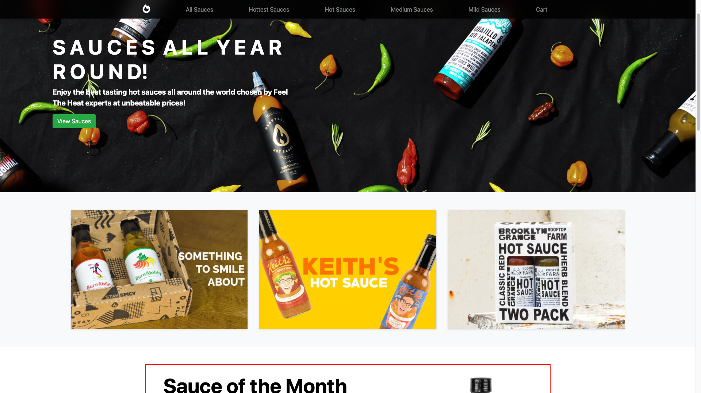
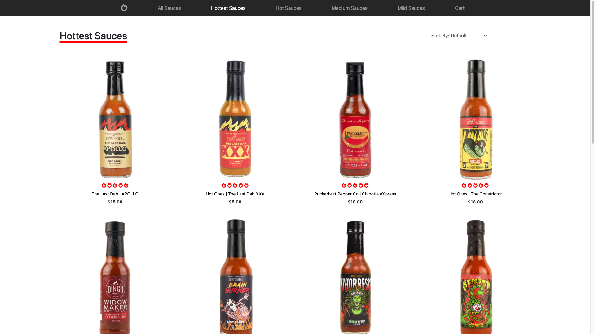
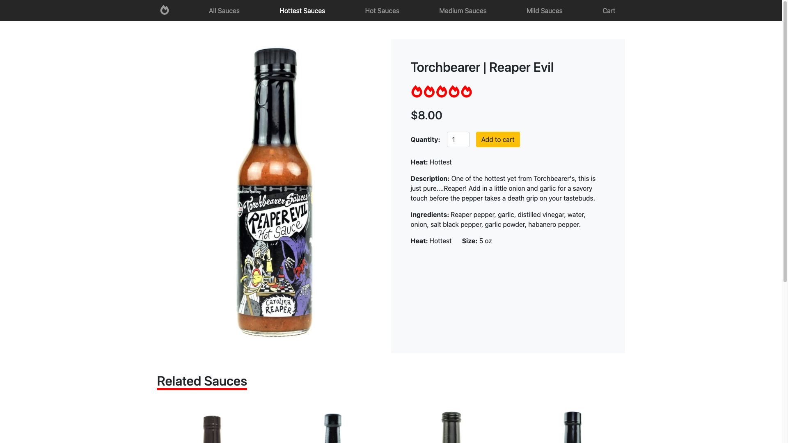
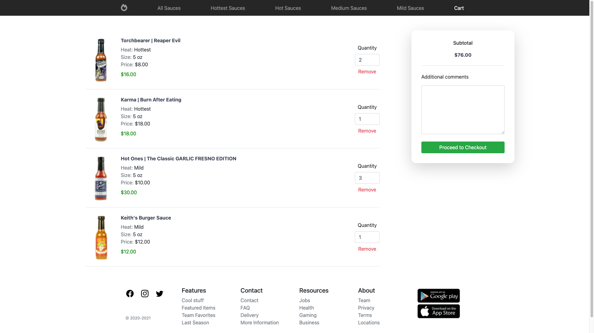
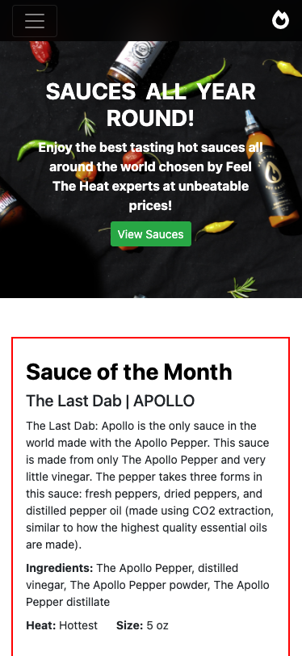
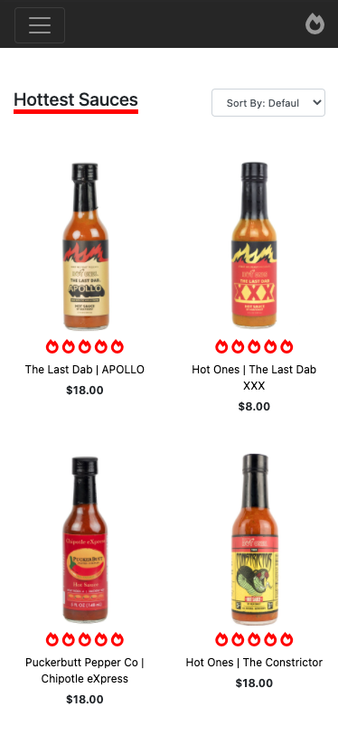
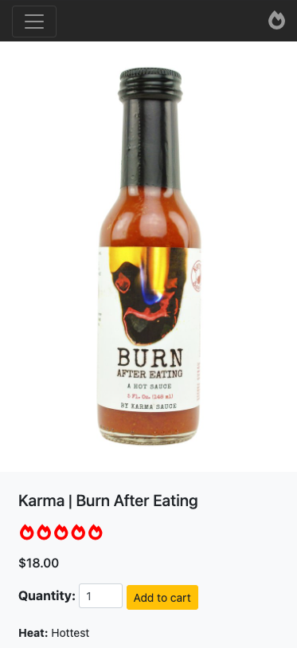
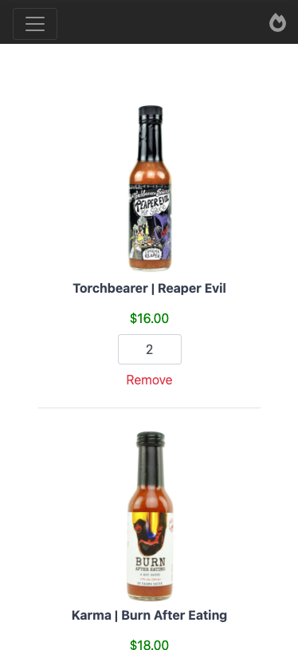

# :computer: Feel The Heat Sauces
This is a fully functional responsive mockup e-commerce website that I developed using the Django framework. The theme surrounding the website is based on hot sauces, a 
user can browse through hot sauces and add them to their cart for later purchase. The user has the option to view all the sauces that are available or look at the
sauces by their 'heat' (how spicy the sauces are). While browsing through the products either by all or by heat, the user can also choose to sort the order of
hot sauces by default, alphabetical order, or by price. Once a user has chosen a sauce to view, they are taken to the sauce's individual page where the user can see
more details about the sauce and also add it to their cart. At checkout the user can see all of the sauces they added, the price of each sauce, the quantity
for each sauce and finally the total of amount for all the sauces. The website is fully responsive and has support for all platforms with all of the same capabilities.

# :pencil2: What I learned 
* Python
* Django Framework
* HTML/CSS/JS
* Bootstrap
* Sqlite
* Heroku Deployment

# :camera: Screenshots
Homepage             
:--------------------------------------------------:

View Multiple Sauces            

View Individual Sauce    

Cart      

  <table>
    <tbody>
      <tr>
        <th align="center">Mobile Homepage</th>
        <th align="center">Mobile Multiple Sauces</th>
      </tr>
      <tr>
        <td></td>
        <td></td>
      </tr>
    </tbody>
  </table>
  <table>
    <tbody>
      <tr>
        <th align="center">Mobile View Individual Sauce</th>
        <th align="center">Mobile Cart</th>
      </tr>
      <tr>
        <td></td>
        <td></td>
      </tr>
    </tbody>
  </table>

